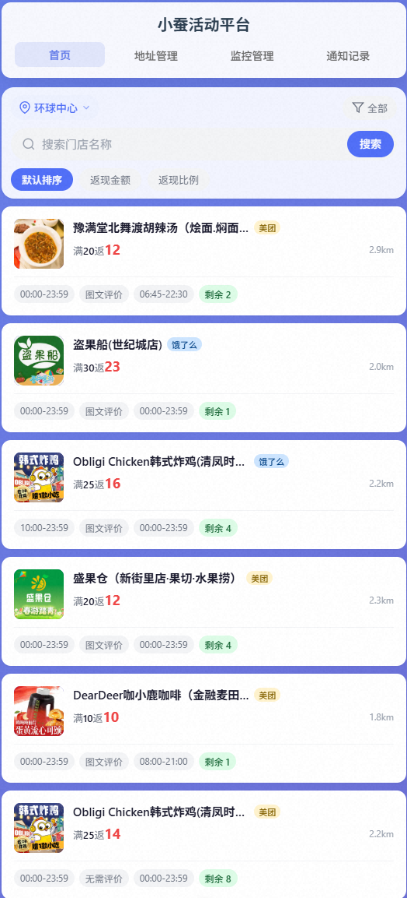
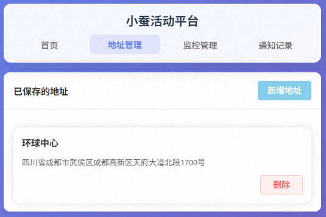

## 无须自己部署，小程序体验

>小程序的功能跟本项目的不一样，本项目只是单独针对小蚕的功能、需要单独部署，只能私人使用。小程序会加些其它活动的通知。
## 更新记录
- 2025年 小蚕有ip检测机制，用了接口请求后，过一段时间后，ip会被封禁，app也会无法使用，用代理可能避免这个问题。
- 2025年8月30日 ip检测机制应该是判断有没有调用其它接口，优化后目前运行了两天暂时未被block。
- 2025年9月21日 取消了轮训和通知，加入了新的页面，可以手动查询活动列表。后期可能会做更加复杂的轮训推送。
- 2025年9月22日 优化了列表，搜索使用官方的搜索接口。不排序则使用官方的分页接口。其它情况获取一批次的数据，手动排序过滤
- 2025年9月23日 添加了活动可抢通知功能，每十分钟检测一次，新增了通知管理页面。
- 2025年9月24日 
    - 添加了自定义通知功能，支持金额差小于指定数值的活动通知，每30分钟检测一次。
    - 优化了不同规则的通知逻辑。
## 注意
- 小蚕有检测机制，如果只调用获取活动列表的接口，一会儿ip就会被封禁。
- 即使模拟了小程序的接口调用逻辑，如果请求参数一模一样，短时间内调用次数过多，会触发腾讯云的WAF，但是ip不会被封，更改经纬度之后还是可以调通（有点奇怪，照理body有分页参数每次都不一样）。
- spt来源：[WxPusher消息推送平台](https://wxpusher.zjiecode.com/docs/#/)
- promotion_id活动id，同一个门店的promotion_id，每天是不一样的。
## todo
- [x] 通知提醒模式1：指定门店活动提醒
- [x] 通知提醒模式2：自定义通知例如：金额差小于指定数值的
- [ ] 自动、手动抢购活动
- [ ] 通知历史，以及再次通知
## 小蚕加密逻辑
请求头有几个参数值得注意。
- X-Garen：毫秒时间戳
- servername：调用服务名
- methodname：调用方法名称
- X-Nami：好像没什么意义，固定或者随机生成均可
- X-Ashe: 加密参数，加密逻辑为
  - 将serverName + "." + methodName相加，得到字符串A。
  - 将字符串A转换为小写得到字符串B。
  - 将字符串B进行MD5加密得到字符串C。
  - 字符串C + X-Garen + X-Nami得到字符串D。
  - 将字符串D进行MD5加密得到字符串E，E即为X-Ashe的值。
## 风险检测
### 关于device_id以及腾讯云WAF
小蚕的检测机制应该是用的数美的sdk，[文档地址](https://help.ishumei.com/docs/tw/sdk/weapp/developDoc)，对于的方法应该是`PlacementMatchService.BatchMatchPlacement`，也就是device_id的来源，通过源码可以发现如下配置信息
```javascript
require.async("../subpack/plugin/pages/fp-wx-lite.min.js")
    .then((function(e) {
        g.SMSdk = e, g.SMSdk.initConf({
            organization: "xIXziPxe6o8HkTczAhHP",
            appId: "default",
            publicKey: "MIGfMA0GCSqGSIb3DQEBAQUAA4GNADCBiQKBgQC1MX7HW+rvThoh80GSJyfev0/+ZgrybkZTKCEQx7O3JXXssy4FLzcUZg3Mz2yQYHSDMauH/GpcNYsRW5BkSKbch3ALRnUcfH+RDVT9zb4Cr4AE/oyt0qNpi5KnsnFufvo3ICHJzGPsWkZxRXdpuIycLmnXpujxdl4NIwDxWAH7BwIDAQAB"
        })
    }))
```
需要注意的是使用的算法应该是非对称的，加密的device_id无法用这个密钥解密。
应该是通过BatchMatchPlacement收集的数据，然后判断进行的风控，从而block IP。
小蚕也接入了腾讯云的WAF，现在被WAF风控的几率感觉大大提升了，暂时不太清楚风控的逻辑。也许跟BatchMatchPlacement有关？
## 截图
### 活动列表页
 
### 地址管理

### 通知管理

