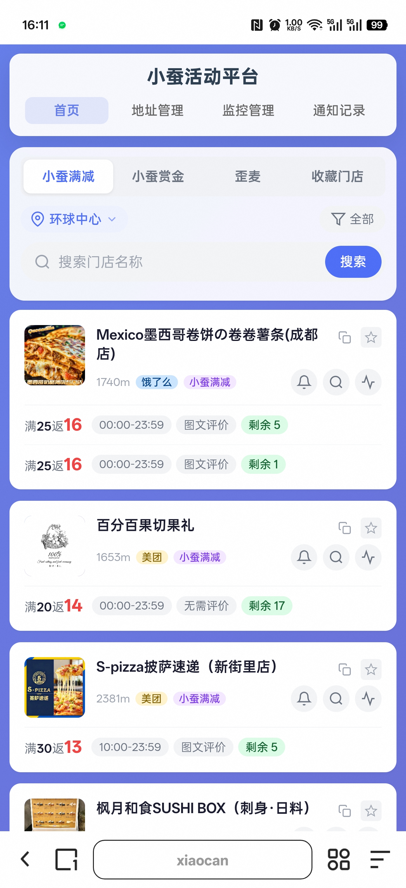
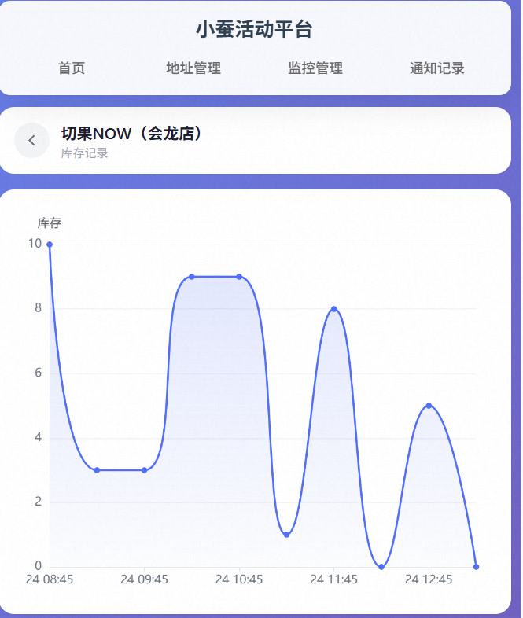
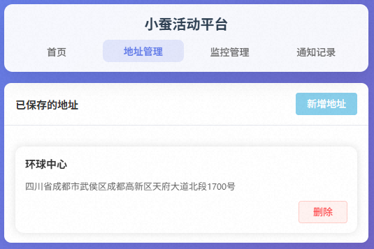
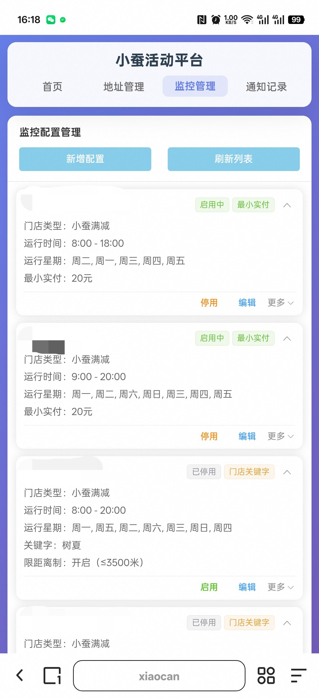
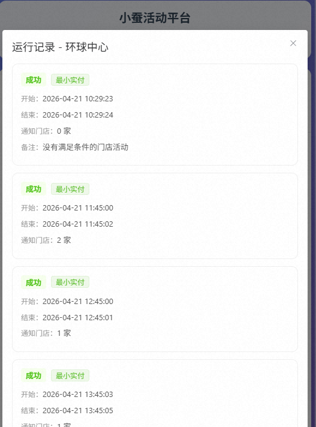
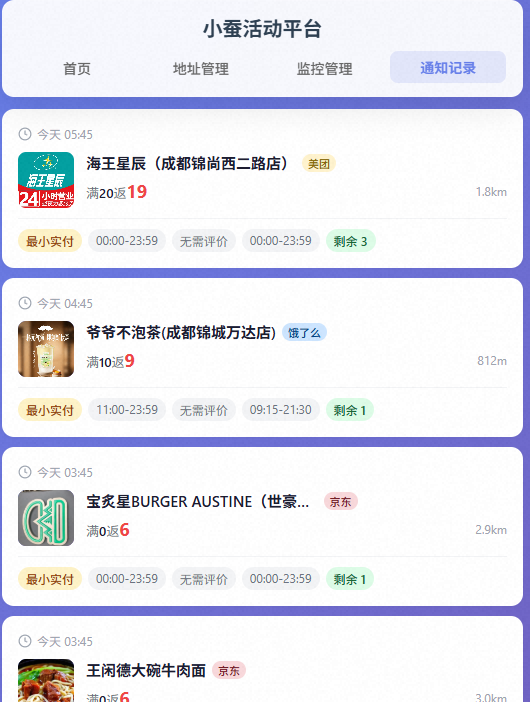
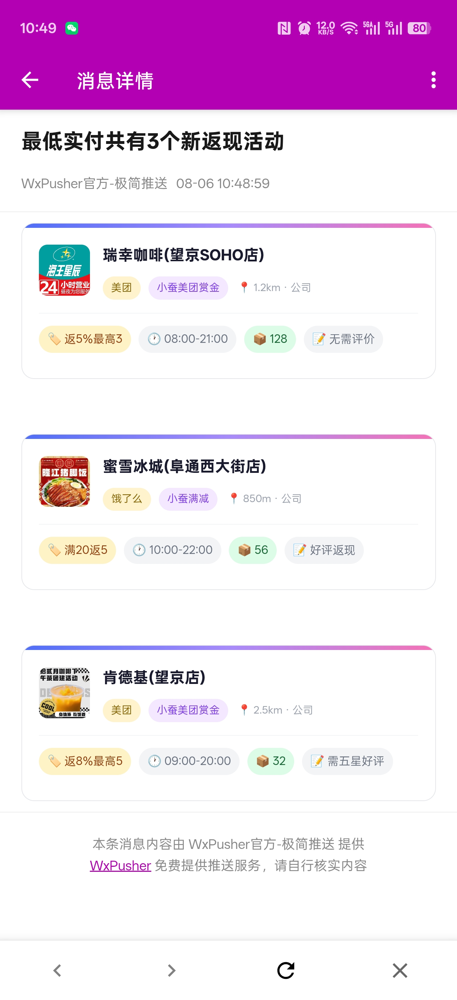
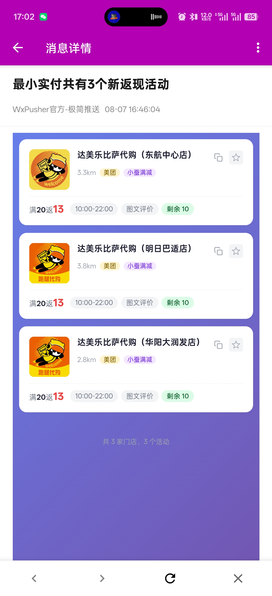

## 小蚕
使用spring boot + vue3开发
## tips
- 若服务可被公网访问，可在application.yaml里配置`system:web-url`，配置后wxpusher推送将会采用iframe方式，可直接在wxpusher里面收藏该门店。
- 浏览器收藏网址时直接带上token参数，会自动识别，避免token丢失,例如：http://xxxx.com/?token=xxxxxxxxx
## [前端 github](https://github.com/lyrric/xiaocan-front)
## 更新记录
见 [CHANGELOG.md](CHANGELOG.md)
## 注意
- 歪麦未登录情况下，只能获取两页的数据。
- 小蚕有检测机制，调用频率过高会被腾讯云WAF拦截，会被封禁几个小时（奇怪的是封禁时间内使用登录信息去访问又是可以的）。
- spt来源：[WxPusher消息推送平台](https://wxpusher.zjiecode.com/docs/#/)
## todo
- [x] 通知提醒模式1：指定门店活动提醒
- [x] 通知提醒模式2：自定义通知例如：金额差小于指定数值的
- [x] 通知历史  
- [x] 以及再次通知
## 截图

### 活动列表页

| 首页 | 折线图 |
| :---: | :---: |
|  |  |

### 地址管理

| 地址管理 |
| :---: |
|  |

### 通知管理

| 监控列表 | 任务详情 |
| :---: | :---: |
|  |  |

### 推送

| 推送记录 | WxPusher 推送 | wxpusher iframe模式 |
| :---: | :---: | :---: |
|  |  |  |